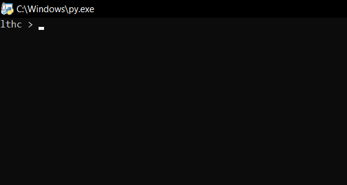
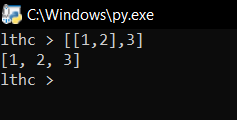
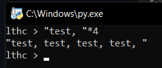
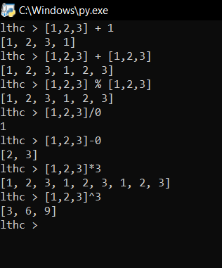
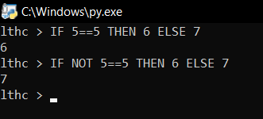

# Tutorial

Welcome on the tutorial, here you can learn the basics of LTHC

## The shell

Before running a program, you have to run the shell (shell.py)

The shell after starting

Here you can use the language instructions, and this shell have an exclusive function (only shell): ``exit`` , this command stop the shell

## Doing some maths

addition:       ``1 + 3``

substraction:   ``2.9 - 17``

multiplication: ``-17 * 19.5783``

division:       ``-3 / -4.2``

arithmetical negation:             ``-5``

quotient of an euclidean division: ``17.3 // 2.2``

modulo:                            ``15 % 7``

power operator:                    ``2 ^ 4``

## Playing with 'VAR'

With the ``VAR`` keyword, you can create and modify variables, there are 3 direct variables types and 2 more special types

Use: ``VAR the_name_of_the_variable = <expression>``

You can create a 'NUM' type variable with a number

You can create a 'STRING' type variable with a string, a string is created by surrounding a text with ``"`` , the escape charater is ``\``

You can create a 'LIST' type variable with value ('LIST' are separed as more simple values in other 'LIST') between square brackets (``[]``)

You can assign to an other variable a 'FUNCTION' (created with ``FUNC``) or a 'BUILT-IN_FUNCTION'

Example of list simplifying

## String manipulation

You can concatenate two strings with the ``+`` operator

You can replicate a string multiple times with the ``*`` operator and a number (or a 'NUM')

Example of replication

## List manipulation

Append and extend: ``listA + listB``

Extend: ``listA % listB``

Get the element at index b in a list: ``listA / b``

Remove (pop) the element at index b in a list: ``listA - b``

Replicate a list multiple times: ``listA * b``

Multiply each value of a list by an other value: ``listA ^ b`` (b is the other value)

Examples of list manipulation

## Info

In the shell you can simulate multiple lines with ``;``

## Conditions

one line syntax: ``IF <condition> THEN <expression> ?(ELIF <condition> THEN <expression>) ?(ELSE <expression>)``

multiple lines syntax: ``IF <condition> THEN {new_line} <expressions> {new_line} END|?(ELIF <condition> THEN {new_line} <expressions> {new_line} END|(ELSE {new_line} <expressions> {new_line} END))|?(ELSE {new_line} <expressions> {new_line} END)``

Examples of simple conditions

### Logic and comparison operator

#### Logic

``a AND b`` ; ``a OR b`` ; ``NOT a``

#### Comparison

``a == b`` ; ``a != b`` ; ``a =! b`` ; ``a > b`` ; ``a < b`` ; ``a >= b`` ; ``a => b`` ; ``a <= b`` ; ``a =< b``

## Loops

### For Loop

one line default syntax: ``FOR var_name = start_value TO end_value THEN <expression>``

multiple lines default syntax: ``FOR var_name = start_value TO end_value THEN {new_line} <expressions> {new_line} END``

one line with ``STEP`` syntax: ``FOR var_name = start_value TO end_value STEP step_value THEN <expression>``

multiple lines with ``STEP`` syntax: ``FOR var_name = start_value TO end_value STEP step_value THEN {new_line} <expressions> {new_line} END``

### While Loop

one line syntax: ``WHILE <condition> THEN <expression>``

multiple lines syntax: ``WHILE <condition> THEN {new_line} <expressions> {new_line} END``

### Break and Continue

``BREAK`` Stop the current loop

``CONTINUE`` Jump to the next iteration of the current loop

## Functions

one line default syntax: ``FUNC func_name(?(<args>)) -> <expression>``

multiple line syntax: ``FUNC func_name(?(<args>)) {new_line} <expressions> {new_line} END``

one line by assignement syntax: ``VAR a_var_name = FUNC (?(<args>)) -> <expression>``

``VAR`` assignement syntax: ``VAR a_var_name = a_defined_function_name``

calling function: ``a_defined_or_assigned_function_name(<the_required_args>)``

### Return

you can add a ``RETURN <something_to_return>`` to your function for customize the returned value

## Builtins

### Functions

``PRINT(val)`` ; ``PRINT_RET(val)`` (output)

``INPUT(msg)`` ; ``INPUT_NUM(msg)`` (input)

``CLEAR()`` (clear the screen)

``IS_NUM(var)`` ; ``IS_STR(var)`` ; ``IS_LIST(var)`` ; ``IS_FUNC(var)`` (type checking function)

``POP(list, index)`` ; ``APPEND(list, val)`` ; ``EXTEND(list1, list2)`` (list manipulation function)

``LEN(val)`` (len of 'val')

``STR(val)`` (cast to 'STRING' type)

``RUN(path)`` (run a .lthc file (LTHC Script))

### Variables

``NULL`` ; ``TRUE`` ; ``FALSE`` ; ``PHI`` ; ``E`` ; ``PI`` ; ``TAU`` ('NUM' type)

``DIGITS`` ('STRING' type)
